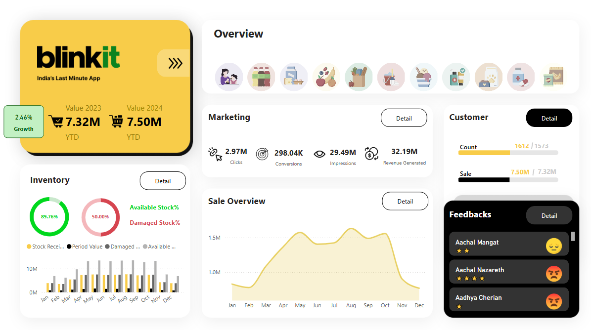
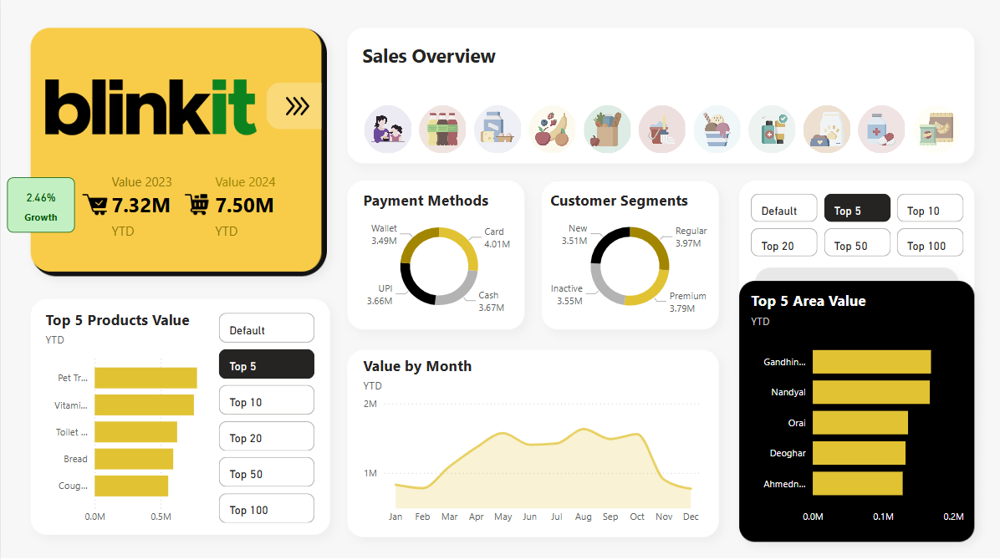
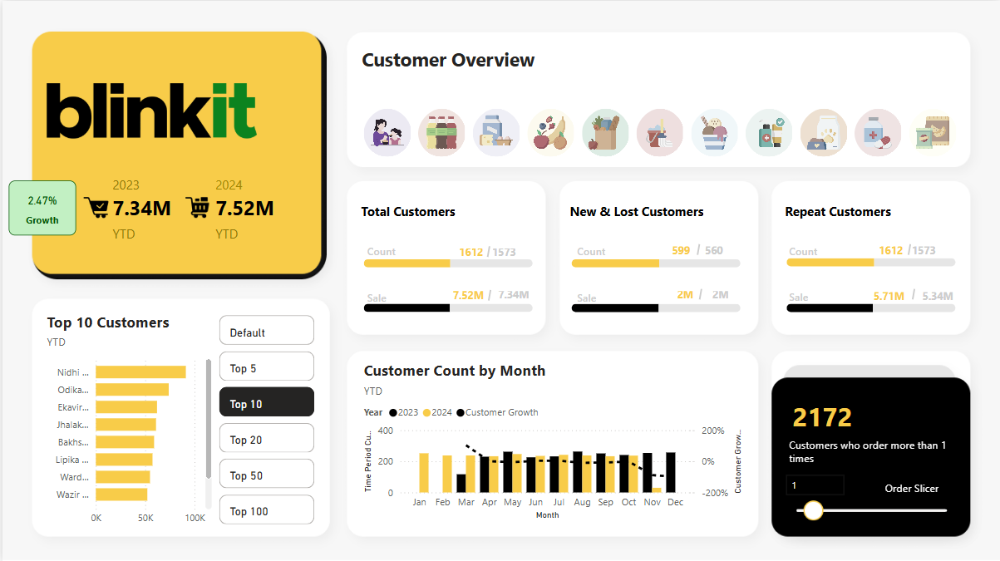
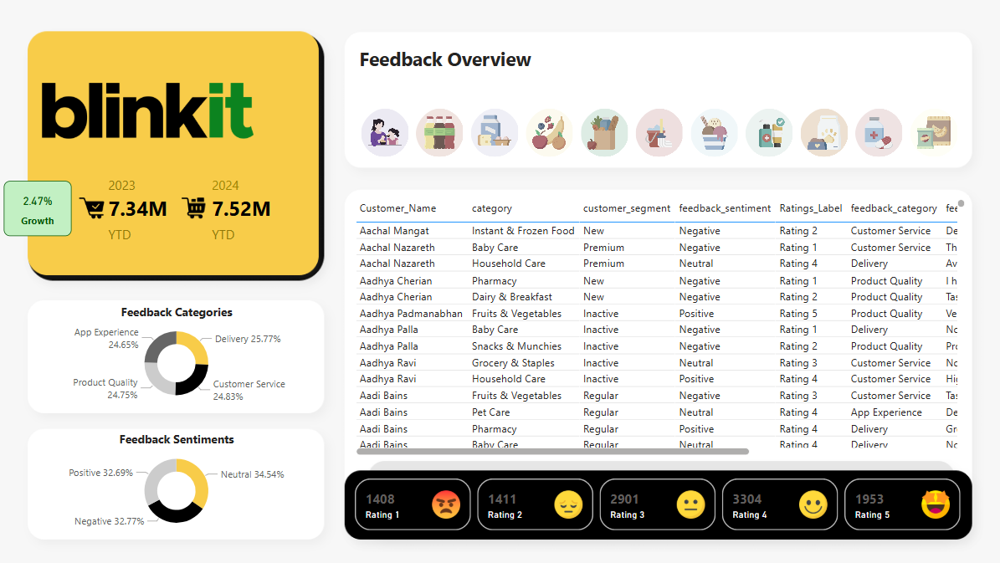
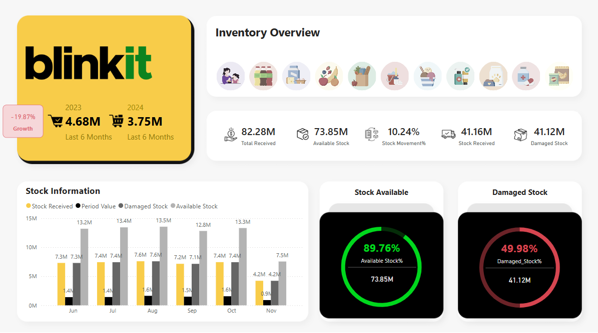
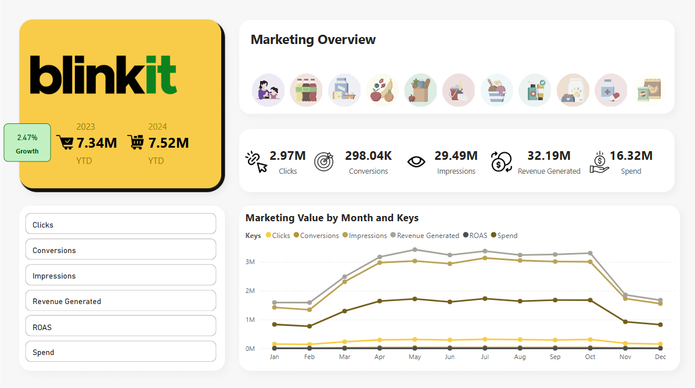

# 🚀 **Blinkit Operational Insights Dashboard**

### 📊 _Real-Time Data Visualization for Enhanced Decision-Making_


## 🛠️ **Project Overview**

The **Blinkit Operational Insights Dashboard** is an interactive Power BI solution designed for **Blinkit**, a quick-commerce platform. The dashboard enables stakeholders to monitor and optimize **key performance indicators (KPIs)** through **real-time data updates, dynamic filtering, and advanced drill-down features**, driving informed decision-making.

## 🎯 **Key Features**

✅ **Real-Time Data Visualization:** Tracks **order trends, delivery efficiency, inventory levels, and customer satisfaction** with up-to-date metrics.  
✅ **Dynamic Filtering & Drill-Downs:** Explore granular insights by filtering data by **time period, region, or product category**.  
✅ **Intuitive Charts & Graphs:** Includes **line charts, donut charts, heatmaps, and bar graphs** for easy data interpretation.  
✅ **Actionable Insights:** Identify **delivery bottlenecks, marketing inefficiencies, and low-stock alerts**, enabling proactive decision-making.

## 🛠️ **Tech Stack**

📊 **Power BI:** For building interactive visualizations.

🛠️ **SQL:** For data extraction and transformation.

📊 **Excel:** For initial data manipulation and validation.

🛠️ **DAX:** For advanced data modeling and calculations.

## 📸 **Project Screenshots**















## 🚀 **Setup Instructions**

1. **Clone the Repository:**

```bash
git clone <repository-url>
```

2. **Open the Power BI Project:**
   Open the .pbix file in Power BI Desktop.

3. **Connect to Your Data Source:**
   Link to your SQL or Excel data source.

4. **Refresh the Data:**
   Load real-time insights by refreshing the data.

5. **Customize the Dashboard:**
   Apply filters, drill-downs, and customize visualizations as needed.

## 📊 Use Cases

- **Business Stakeholders:** Gain high-level summaries for strategic decision-making.

- **Operations Managers:** Identify delivery inefficiencies and optimize processes.

- **Data Analysts:** Extract and analyze detailed backend data for deeper insights.

## 📚 Project Structure

```bash
/Background_Images        # Dashboard screenshots
/Excel_Dataset            # Sample data files
/Icons                    # Dashboard Icons
/MySQL_Dataset            # Sample SQL Database files
/Screenshots              # Dashboard screenshots
BlinkitDashboard.pbix     # Power BI (.pbix) file
README.md                 # Project documentation
```

## 📈 Future Enhancements

🛠️ Predictive Analytics: Add machine learning models to forecast order trends.

📊 Geospatial Visualizations: Integrate maps for region-specific analysis.

🔍 AI-Powered Sentiment Analysis: Analyze customer reviews for deeper insights.

## 📩 Contributing

Contributions are welcome!

- Fork the repository.
- Create a new branch (git checkout -b feature-branch).
- Commit your changes (git commit -m "Add new feature").
- Push the branch (git push origin feature-branch).
- Open a pull request.

## 👥 **Contact**

[](mailto:manavparikh198@gmail.com) [](https://www.linkedin.com/in/manav-parikh-a50096215/)
